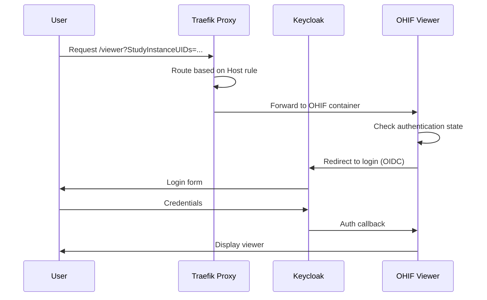
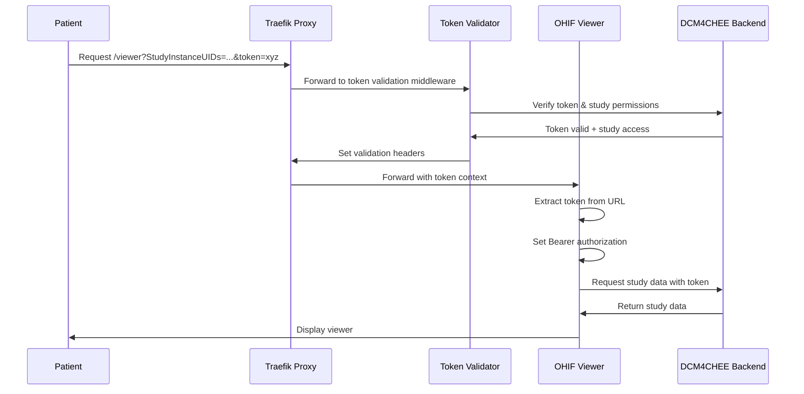
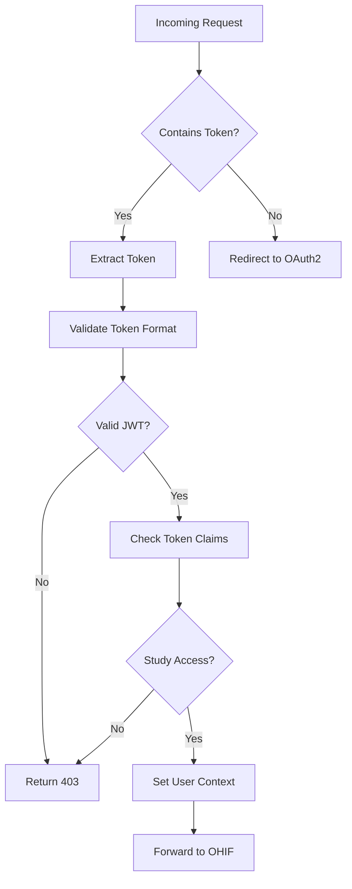
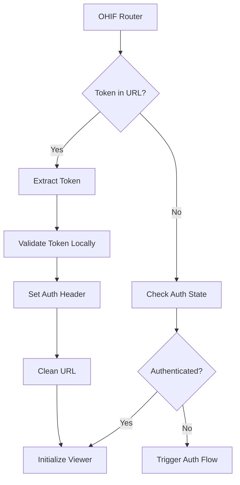
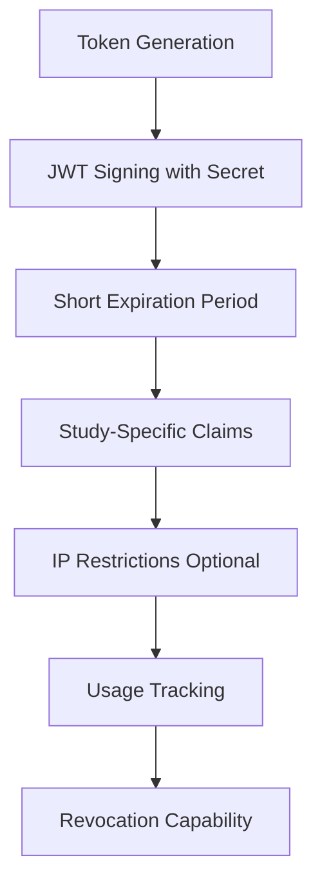

# Token-Based Access Design

## Overview

This design extends the OHIF Viewer to support secure token-based access that bypasses Keycloak authentication for patient sharing scenarios. The solution enables direct patient access to studies via shareable URLs containing pre-validated tokens, while maintaining the existing authentication system for standard users.

## Architecture

### Current Authentication Flow



### Enhanced Token-Based Access Flow



## Component Architecture

### Token Validation Service



### OHIF Client Token Handling



## Technical Implementation

### 1. Traefik Configuration Enhancement

| Component | Configuration | Purpose |
|-----------|---------------|---------|
| Custom Middleware | `token-auth` | Handle token-based authentication |
| Router Rules | Host + Query params | Route based on token presence |
| Forward Auth | External service | Validate tokens before routing |
| Header Manipulation | Add/Remove headers | Pass token context to OHIF |

### 2. Token Validation Middleware

| Feature | Implementation | Technology |
|---------|----------------|------------|
| JWT Validation | Library-based validation | Node.js + jsonwebtoken |
| Claims Verification | Custom middleware | Express.js |
| Study Access Control | Database lookup | Study permissions table |
| Token Caching | Redis cache | Short-term token validation cache |

### 3. OHIF Token Integration

| Component | Modification | Impact |
|-----------|-------------|---------|
| Mode.tsx | Enhanced token extraction | Parse token before auth check |
| UserAuthenticationService | Token-based implementation | Bypass OIDC for token users |
| API Requests | Bearer token injection | All DICOM/metadata requests |
| URL Cleanup | History API integration | Remove token from browser history |

## Data Models

### Token Structure (JWT)

```typescript
interface ShareToken {
  // Standard JWT Claims
  iss: string;          // Issuer (your application)
  sub: string;          // Subject (patient/user identifier)
  aud: string;          // Audience (OHIF viewer)
  exp: number;          // Expiration timestamp
  iat: number;          // Issued at timestamp
  jti: string;          // JWT ID (unique token identifier)

  // Custom Claims
  studyAccess: string[];    // Array of StudyInstanceUIDs
  permissions: string[];    // Array of permissions (read, download, etc.)
  patientId?: string;       // Patient identifier
  shareContext: {
    sharedBy: string;       // User who created the share
    shareType: 'patient' | 'provider' | 'research';
    restrictions?: {
      ipWhitelist?: string[];
      timeWindow?: {
        start: number;
        end: number;
      };
    };
  };
}
```

### Token Validation Response

```typescript
interface TokenValidationResult {
  valid: boolean;
  user?: {
    id: string;
    type: 'token' | 'authenticated';
    studyAccess: string[];
    permissions: string[];
  };
  error?: {
    code: string;
    message: string;
  };
}
```

## API Integration

### Token Generation Endpoint

| Method | Endpoint | Purpose |
|--------|----------|---------|
| POST | `/api/shares/create` | Generate shareable token |

**Request:**
```typescript
{
  studyInstanceUIDs: string[];
  expiresIn: string;        // "7d", "24h", etc.
  permissions: string[];    // ["read", "download"]
  shareType: string;        // "patient", "provider"
  restrictions?: {
    ipWhitelist?: string[];
    maxUses?: number;
  };
}
```

**Response:**
```typescript
{
  token: string;
  shareUrl: string;
  expiresAt: string;
  shareId: string;
}
```

### Token Validation Endpoint

| Method | Endpoint | Purpose |
|--------|----------|---------|
| POST | `/api/auth/validate-token` | Validate share token |

**Request:**
```typescript
{
  token: string;
  studyInstanceUIDs?: string[];  // Optional: validate study access
  clientIp?: string;             // Optional: IP validation
}
```

## Security Considerations

### Token Security Model



### Security Measures

| Security Layer | Implementation | Purpose |
|----------------|----------------|---------|
| JWT Signature | RSA256 or HS256 signing | Prevent token tampering |
| Time-based Expiration | Configurable TTL | Limit exposure window |
| Study-specific Claims | StudyInstanceUID validation | Prevent unauthorized access |
| IP Restrictions | Optional IP whitelisting | Geographic/network controls |
| Usage Tracking | Database logging | Audit and monitoring |
| Token Revocation | Blacklist/cache invalidation | Emergency access removal |

## Testing Strategy

### Unit Testing

| Component | Test Cases | Coverage |
|-----------|------------|----------|
| Token Validator | Valid/invalid tokens, expired tokens, malformed JWTs | 90%+ |
| OHIF Token Handler | URL parsing, auth header setting, cleanup | 90%+ |
| API Endpoints | Token generation, validation responses | 90%+ |

### Integration Testing

| Scenario | Test Description | Expected Result |
|----------|-----------------|-----------------|
| Valid Token Access | User clicks share link with valid token | Direct viewer access |
| Expired Token | User accesses with expired token | Error message, no access |
| Invalid Study Access | Token without study permissions | 403 Forbidden |
| Token Cleanup | URL token removal after processing | Clean browser URL |

### End-to-End Testing

| User Story | Test Steps | Validation |
|------------|------------|------------|
| Patient Share Link | Generate → Share → Access → View | Complete flow success |
| Token Expiration | Generate → Wait → Access | Proper expiration handling |
| Multi-Study Access | Generate for multiple studies → Access | Correct study filtering |

## Deployment Strategy

### Traefik Configuration Updates

```yaml
# docker-compose.yml additions
services:
  # Token validation service
  token-validator:
    image: your-registry/token-validator:latest
    networks:
      - traefik_network
    environment:
      - JWT_SECRET=${JWT_SECRET}
      - DCM4CHEE_URL=http://dcm4chee:8080
    labels:
      - traefik.enable=true
      - traefik.http.services.token-validator.loadbalancer.server.port=3001

  ohif-viewer:
    # ... existing configuration ...
    labels:
      - traefik.enable=true
      # Standard route (no token)
      - traefik.http.routers.ohif_app.rule=Host(`viewerdicom.cloudcompuexpediente.com`)
      - traefik.http.routers.ohif_app.entrypoints=websecure
      - traefik.http.routers.ohif_app.tls.certresolver=letsencryptresolver
      - traefik.http.routers.ohif_app.service=ohif_app

      # Token-based route with higher priority
      - traefik.http.routers.ohif_token.rule=Host(`viewerdicom.cloudcompuexpediente.com`) && Query(`token`)
      - traefik.http.routers.ohif_token.entrypoints=websecure
      - traefik.http.routers.ohif_token.tls.certresolver=letsencryptresolver
      - traefik.http.routers.ohif_token.service=ohif_app
      - traefik.http.routers.ohif_token.priority=100
      - traefik.http.routers.ohif_token.middlewares=token-auth@docker

      # Token validation middleware
      - traefik.http.middlewares.token-auth.forwardauth.address=http://token-validator:3001/validate
      - traefik.http.middlewares.token-auth.forwardauth.authResponseHeaders=X-User-ID,X-Study-Access,X-Permissions

      # Service configuration
      - traefik.http.services.ohif_app.loadbalancer.server.port=80
      - traefik.http.services.ohif_app.loadbalancer.passhostheader=true
```

### Token Validation Service Implementation

```javascript
// token-validator/index.js
const express = require('express');
const jwt = require('jsonwebtoken');
const axios = require('axios');

const app = express();
const JWT_SECRET = process.env.JWT_SECRET;
const DCM4CHEE_URL = process.env.DCM4CHEE_URL;

// Traefik ForwardAuth validation endpoint
app.get('/validate', async (req, res) => {
  try {
    const token = req.query.token || req.headers['x-forwarded-token'];

    if (!token) {
      return res.status(401).json({ error: 'No token provided' });
    }

    // Verify JWT token
    const decoded = jwt.verify(token, JWT_SECRET);

    // Validate token claims and study access
    const isValid = await validateStudyAccess(decoded, req.query);

    if (!isValid) {
      return res.status(403).json({ error: 'Invalid study access' });
    }

    // Set response headers for Traefik to forward
    res.set({
      'X-User-ID': decoded.sub,
      'X-Study-Access': JSON.stringify(decoded.studyAccess),
      'X-Permissions': JSON.stringify(decoded.permissions),
      'X-Token-Valid': 'true'
    });

    res.status(200).send('OK');
  } catch (error) {
    console.error('Token validation error:', error);
    res.status(401).json({ error: 'Invalid token' });
  }
});

async function validateStudyAccess(decoded, queryParams) {
  // Check if requested studies are in token's allowed studies
  const requestedStudies = queryParams.StudyInstanceUIDs?.split(',') || [];

  for (const studyUID of requestedStudies) {
    if (!decoded.studyAccess.includes(studyUID)) {
      return false;
    }
  }

  // Optional: Verify studies exist in DCM4CHEE
  if (process.env.VALIDATE_STUDY_EXISTENCE === 'true') {
    try {
      for (const studyUID of requestedStudies) {
        const response = await axios.get(
          `${DCM4CHEE_URL}/dcm4chee-arc/aets/DCM4CHEE/rs/studies/${studyUID}/metadata`,
          { headers: { Authorization: `Bearer ${process.env.DCM4CHEE_API_TOKEN}` } }
        );
        if (response.status !== 200) {
          return false;
        }
      }
    } catch (error) {
      console.error('Study validation error:', error);
      return false;
    }
  }

  return true;
}

app.listen(3001, () => {
  console.log('Token validator listening on port 3001');
});
```

### Environment Configuration

| Variable | Purpose | Example |
|----------|---------|---------|
| `TOKEN_SECRET` | JWT signing secret | Random 256-bit key |
| `TOKEN_EXPIRY_DEFAULT` | Default token lifespan | "24h" |
| `TOKEN_VALIDATOR_URL` | Validation service URL | "http://token-service:3001" |
| `ENABLE_TOKEN_AUTH` | Feature flag | "true" |

### Complete Docker Compose Integration

```yaml
# Updated docker-compose.yml for your setup
version: '3.8'

services:
  # Your existing services...
  ldap:
    image: dcm4che/slapd-dcm4chee:2.6.6-32.1
    volumes:
      - ldap_data:/var/lib/openldap/openldap-data
      - ldap_config:/etc/openldap/slapd.d
    networks:
      - traefik_network
    ports:
      - "389:389"

  keycloak:
    image: dcm4che/keycloak:26.0.6
    restart: unless-stopped
    environment:
      - KEYCLOAK_USER=admin
      - KEYCLOAK_PASSWORD=ivirtual
      - KEYCLOAK_ADMIN=admin
      - KEYCLOAK_ADMIN_PASSWORD=ivirtual
      - KC_BOOTSTRAP_ADMIN_USERNAME=admin
      - KC_BOOTSTRAP_ADMIN_PASSWORD=ivirtual
      - KC_DB_VENDOR=postgres
      - KC_DB=postgres
      - KC_DB_URL=jdbc:postgresql://cloudcompuexpediente.com:5432/keycloak
      - KC_DB_USERNAME=ismael7
      - KC_DB_PASSWORD=Qwertyuiop7
      - KC_HOSTNAME=https://authdicom.cloudcompuexpediente.com
      - KC_HTTP_PORT=8080
      - KC_HTTPS_PORT=8843
      - KC_HOSTNAME_BACKCHANNEL_DYNAMIC=false
      - KC_HOSTNAME_STRICT=false
      - KC_HOSTNAME_STRICT_HTTPS=false
      - KC_HTTP_ENABLED=true
      - KEYCLOAK_WAIT_FOR=ldap:389
      - KEYCLOAK_LDAP_URL=ldap://ldap:389
    depends_on:
      - ldap
    networks:
      - traefik_network
    labels:
      - traefik.enable=true
      - traefik.http.routers.keycloak_app.rule=Host(`authdicom.cloudcompuexpediente.com`)
      - traefik.http.routers.keycloak_app.entrypoints=websecure
      - traefik.http.routers.keycloak_app.tls.certresolver=letsencryptresolver
      - traefik.http.routers.keycloak_app.service=keycloak_app
      - traefik.http.services.keycloak_app.loadbalancer.server.port=8080
      - traefik.http.services.keycloak_app.loadbalancer.passhostheader=true
      - traefik.http.middlewares.sslheader.headers.customrequestheaders.X-Forwarded-Proto=https
      - traefik.http.routers.keycloak_app.middlewares=sslheader@docker
    ports:
      - "8080:8080"
      - "8843:8843"

  dcm4chee:
    image: dcm4che/dcm4chee-arc-psql:5.34.1-secure
    restart: unless-stopped
    ports:
      - "8847:8080"
      - "8443:8443"
      - "9990:9990"
      - "9993:9993"
      - "8787:8787"
      - "11112:11112"
      - "2762:2762"
      - "2575:2575"
      - "12575:12575"
    depends_on:
      - ldap
      - keycloak
    environment:
      - WILDFLY_ADMIN_USER=admin
      - WILDFLY_ADMIN_PASSWORD=ivirtual
      - WILDFLY_PACSDS_USE_CCM=false
      - POSTGRES_DB=pacsdb
      - POSTGRES_USER=ismael7
      - POSTGRES_PASSWORD=Qwertyuiop7
      - POSTGRES_HOST=cloudcompuexpediente.com
      - POSTGRES_PORT=5432
      - AUTH_SERVER_URL=https://authdicom.cloudcompuexpediente.com
      - UI_AUTH_SERVER_URL=https://authdicom.cloudcompuexpediente.com
      - WILDFLY_CHOWN=/opt/wildfly/standalone /storage
    volumes:
      - dcm4chee_storage:/storage
      - dcm4chee-wildfly:/opt/wildfly/standalone
    networks:
      - traefik_network
    labels:
      - traefik.enable=true
      - traefik.http.routers.dcm4chee_app.rule=Host(`pacsdicom.cloudcompuexpediente.com`)
      - traefik.http.routers.dcm4chee_app.entrypoints=websecure
      - traefik.http.routers.dcm4chee_app.tls.certresolver=letsencryptresolver
      - traefik.http.routers.dcm4chee_app.service=dcm4chee_app
      - traefik.http.services.dcm4chee_app.loadbalancer.server.port=8080
      - traefik.http.services.dcm4chee_app.loadbalancer.passhostheader=true
      - traefik.http.middlewares.sslheader.headers.customrequestheaders.X-Forwarded-Proto=https
      - traefik.http.routers.dcm4chee_app.middlewares=sslheader@docker

  # NEW: Token validation service
  token-validator:
    build: ./token-validator
    restart: unless-stopped
    networks:
      - traefik_network
    environment:
      - JWT_SECRET=${JWT_SECRET:-your-super-secret-key-here}
      - DCM4CHEE_URL=http://dcm4chee:8080
      - DCM4CHEE_API_TOKEN=${DCM4CHEE_API_TOKEN}
      - VALIDATE_STUDY_EXISTENCE=true
      - NODE_ENV=production
    labels:
      - traefik.enable=true
      - traefik.http.services.token-validator.loadbalancer.server.port=3001

  # UPDATED: OHIF Viewer with token support
  ohif-viewer:
    image: etahamad/ohif-viewer:2bd93e3
    restart: unless-stopped
    ports:
      - 3000:80
    environment:
      - APP_CONFIG=/usr/share/nginx/html/app-config-temp.js
    volumes:
      - /etc/docker/viewerdicom/app-config.js:/usr/share/nginx/html/app-config-temp.js
    networks:
      - traefik_network
    labels:
      - traefik.enable=true

      # Standard route (no token) - existing behavior
      - traefik.http.routers.ohif_app.rule=Host(`viewerdicom.cloudcompuexpediente.com`) && !Query(`token`)
      - traefik.http.routers.ohif_app.entrypoints=websecure
      - traefik.http.routers.ohif_app.tls.certresolver=letsencryptresolver
      - traefik.http.routers.ohif_app.service=ohif_app
      - traefik.http.routers.ohif_app.priority=50

      # Token-based route with higher priority
      - traefik.http.routers.ohif_token.rule=Host(`viewerdicom.cloudcompuexpediente.com`) && Query(`token`)
      - traefik.http.routers.ohif_token.entrypoints=websecure
      - traefik.http.routers.ohif_token.tls.certresolver=letsencryptresolver
      - traefik.http.routers.ohif_token.service=ohif_app
      - traefik.http.routers.ohif_token.priority=100
      - traefik.http.routers.ohif_token.middlewares=token-auth@docker

      # Token validation middleware using ForwardAuth
      - traefik.http.middlewares.token-auth.forwardauth.address=http://token-validator:3001/validate
      - traefik.http.middlewares.token-auth.forwardauth.authResponseHeaders=X-User-ID,X-Study-Access,X-Permissions,X-Token-Valid
      - traefik.http.middlewares.token-auth.forwardauth.trustForwardHeader=true

      # Service configuration
      - traefik.http.services.ohif_app.loadbalancer.server.port=80
      - traefik.http.services.ohif_app.loadbalancer.passhostheader=true
      - traefik.http.middlewares.sslheader.headers.customrequestheaders.X-Forwarded-Proto=https

volumes:
  dcm4chee_storage:
  dcm4chee-wildfly:
  ldap_data:
  ldap_config:

### Token Validator Implementation Files

#### Token Validator Dockerfile

```dockerfile
# token-validator/Dockerfile
FROM node:18-alpine

WORKDIR /app

# Copy package files
COPY package*.json ./
RUN npm ci --only=production

# Copy application code
COPY . .

# Create non-root user
RUN addgroup -g 1001 -S nodejs && \
    adduser -S validator -u 1001

USER validator

EXPOSE 3001

CMD ["node", "index.js"]
```

#### Token Validator Package.json

```json
{
  "name": "token-validator",
  "version": "1.0.0",
  "description": "JWT token validation service for OHIF",
  "main": "index.js",
  "scripts": {
    "start": "node index.js",
    "dev": "nodemon index.js"
  },
  "dependencies": {
    "express": "^4.18.2",
    "jsonwebtoken": "^9.0.2",
    "axios": "^1.6.0",
    "helmet": "^7.1.0",
    "cors": "^2.8.5"
  },
  "devDependencies": {
    "nodemon": "^3.0.1"
  }
}
```

### Database Schema Updates

```sql
-- Token shares table
CREATE TABLE study_shares (
    id UUID PRIMARY KEY DEFAULT gen_random_uuid(),
    token_jti VARCHAR(255) UNIQUE NOT NULL,
    created_by UUID NOT NULL,
    study_instance_uids TEXT[] NOT NULL,
    permissions TEXT[] NOT NULL DEFAULT ARRAY['read'],
    expires_at TIMESTAMP NOT NULL,
    created_at TIMESTAMP DEFAULT NOW(),
    last_accessed TIMESTAMP,
    access_count INTEGER DEFAULT 0,
    revoked BOOLEAN DEFAULT FALSE,
    client_restrictions JSONB
);

-- Audit log for token usage
CREATE TABLE token_access_log (
    id UUID PRIMARY KEY DEFAULT gen_random_uuid(),
    share_id UUID REFERENCES study_shares(id),
    accessed_at TIMESTAMP DEFAULT NOW(),
    client_ip INET,
    user_agent TEXT,
    study_accessed VARCHAR(255),
    success BOOLEAN NOT NULL
);
```

## Configuration Updates

### Application Configuration

```javascript
// Additional OHIF config for token support
{
  tokenAuthentication: {
    enabled: true,
    validateEndpoint: "/api/auth/validate-token",
    allowedStudyAccess: true,
    cleanUrlAfterExtraction: true
  },
  // Enhanced authentication service implementation
  userAuthenticationService: {
    implementation: "hybrid", // Supports both OIDC and token
    tokenHeader: "Authorization",
    tokenPrefix: "Bearer "
  }
}
```

### Mode Configuration Enhancement

```javascript
// Updated mode initialization for token support
const mode = {
  routes: [{
    path: 'viewer',
    init: async ({ servicesManager, query }) => {
      const token = query.get('token');
      if (token) {
        // Handle token-based authentication
        await handleTokenAuthentication(token, servicesManager);
      }
      // Continue with standard initialization
    }
  }]
};
```

This design provides a comprehensive solution for implementing secure token-based access while maintaining compatibility with the existing authentication system. The implementation allows patients to access shared studies directly without requiring Keycloak authentication, while preserving security through JWT validation and access controls.
