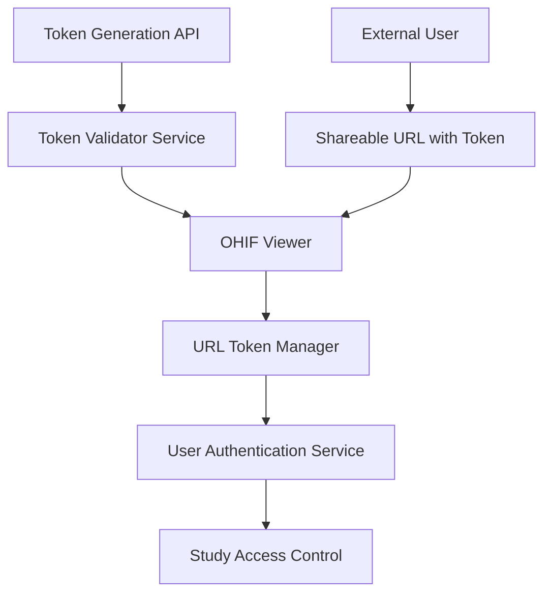
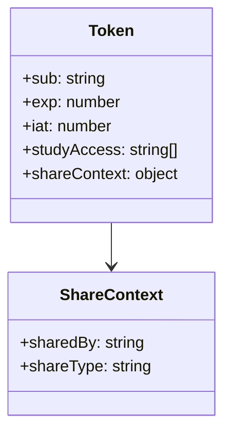
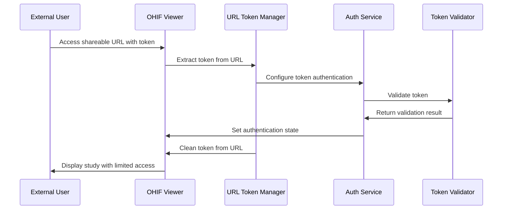

# OHIF Token-Based Access Implementation Guide

## Overview

The OHIF Viewer has implemented a token-based authentication system that allows secure sharing of medical imaging studies without requiring full user registration. This system enables authorized users to generate time-limited access tokens for specific studies, creating shareable URLs that can be distributed to external parties (patients, referring physicians, etc.) for viewing medical images.

## Architecture

### System Components



### Key Services

1. **Token Validator Service** (`token-validator/`)
   - JWT token generation and validation
   - Study access permission enforcement
   - Rate limiting and security middleware

2. **URL Token Manager** (`platform/app/src/utils/urlTokenManager.ts`)
   - Token extraction from URLs
   - URL cleanup and sanitization
   - Shareable URL generation

3. **User Authentication Service** (`platform/core/src/services/UserAuthenticationService/`)
   - Token-based authentication state management
   - Authorization header injection
   - User profile management for token users

## Token Generation & Sharing

### API Endpoints

#### Create Share Token
```
POST /api/shares/create
```

**Request Body:**
```json
{
  "studyInstanceUIDs": ["1.2.3.4.5", "1.2.3.4.6"],
  "sharedBy": "doctor123",
  "expiresIn": "24h"
}
```

**Response:**
```json
{
  "token": "eyJhbGciOiJIUzI1NiIsInR5cCI6IkpXVCJ9...",
  "shareUrl": "http://localhost/viewer?StudyInstanceUIDs=1.2.3.4.5,1.2.3.4.6&token=...",
  "expiresAt": "2024-01-02T12:00:00.000Z"
}
```

### Token Structure



## User Interface Integration

### Current Implementation Status

**Missing Components**: The current codebase does **not** include a built-in share button UI component in the default viewer interface. The token-based access system exists as a backend service, but the frontend sharing interface needs to be implemented.

### Recommended UI Implementation

#### Share Button Location
The share button should be integrated into the viewer toolbar or header menu:

```typescript
// In ViewerHeader.tsx or toolbar configuration
const shareButton = {
  id: 'ShareStudy',
  label: 'Share Study',
  icon: 'share',
  commands: ['shareStudy'],
  evaluate: {
    name: 'evaluate.cornerstoneTool',
    disabledText: 'Share not available'
  }
};
```

#### Share Modal Component
```jsx
interface ShareModalProps {
  studyInstanceUIDs: string[];
  onClose: () => void;
  servicesManager: any;
}

const ShareModal = ({ studyInstanceUIDs, onClose, servicesManager }) => {
  const [expiresIn, setExpiresIn] = useState('24h');
  const [shareUrl, setShareUrl] = useState('');
  const [loading, setLoading] = useState(false);

  const generateShareUrl = async () => {
    setLoading(true);
    try {
      const response = await fetch('/api/shares/create', {
        method: 'POST',
        headers: { 'Content-Type': 'application/json' },
        body: JSON.stringify({
          studyInstanceUIDs,
          sharedBy: 'current-user',
          expiresIn
        })
      });
      const data = await response.json();
      setShareUrl(data.shareUrl);
    } catch (error) {
      console.error('Failed to generate share URL:', error);
    } finally {
      setLoading(false);
    }
  };

  return (
    <Modal>
      <div className="p-6">
        <h2>Share Study</h2>
        <div className="mb-4">
          <label>Expires In:</label>
          <select value={expiresIn} onChange={(e) => setExpiresIn(e.target.value)}>
            <option value="1h">1 Hour</option>
            <option value="24h">24 Hours</option>
            <option value="7d">7 Days</option>
          </select>
        </div>
        <button onClick={generateShareUrl} disabled={loading}>
          {loading ? 'Generating...' : 'Generate Share Link'}
        </button>
        {shareUrl && (
          <div className="mt-4">
            <input value={shareUrl} readOnly />
            <button onClick={() => navigator.clipboard.writeText(shareUrl)}>
              Copy Link
            </button>
          </div>
        )}
      </div>
    </Modal>
  );
};
```

### Integration with Toolbar Service

```typescript
// Extension module registration
export function getCommandsModule({ servicesManager, commandsManager }) {
  return {
    definitions: {
      shareStudy: {
        commandFn: ({ studyInstanceUIDs }) => {
          const { uiModalService } = servicesManager.services;
          uiModalService.show({
            content: ShareModal,
            title: 'Share Study',
            contentProps: {
              studyInstanceUIDs,
              onClose: () => uiModalService.hide(),
              servicesManager
            }
          });
        }
      }
    }
  };
}

export function getToolbarModule() {
  return [
    {
      name: 'shareStudy',
      defaultComponent: ShareButton,
      clickHandler: ({ commands }) => {
        const studyInstanceUIDs = getActiveStudyUIDs(); // Implementation needed
        commands.run('shareStudy', { studyInstanceUIDs });
      }
    }
  ];
}
```

## Token Usage Flow

### For Token Recipients

1. **Access via Shareable URL**
   ```
   https://viewer.domain.com/viewer?StudyInstanceUIDs=1.2.3.4.5&token=eyJ...
   ```

2. **Automatic Token Processing**
   - Token extracted from URL parameters
   - Authentication service configured for token-based access
   - Token removed from URL for security
   - User gains access to specified studies only

### Authentication Flow



## Security Considerations

### Token Validation
- JWT signature verification
- Expiration time enforcement
- Study access permission validation
- Rate limiting protection

### URL Security
- Automatic token removal from browser history
- Parameter sanitization
- HTTPS enforcement recommended

### Access Control
- Study-specific permissions
- Time-limited access
- Read-only access by default
- Audit logging for token usage

## Implementation Requirements

### Backend Services
✅ **Implemented:**
- Token validator service
- JWT generation and validation
- Study access control
- URL token management utilities

### Frontend Components
❌ **Missing - Needs Implementation:**
- Share button in viewer toolbar
- Share modal/dialog component
- Token expiration handling in UI
- Error handling for invalid/expired tokens

### Configuration
- Environment variables for JWT secret
- OHIF base URL configuration
- Token expiration defaults
- Security headers and CORS settings

## Deployment Configuration

### Environment Variables
```bash
JWT_SECRET=your-super-secret-key-here
OHIF_BASE_URL=https://your-viewer-domain.com
DCM4CHEE_URL=http://dcm4chee:8080
PORT=3001
```

### Docker Setup
```yaml
version: '3.8'
services:
  token-validator:
    build: ./token-validator
    environment:
      - JWT_SECRET=${JWT_SECRET}
      - OHIF_BASE_URL=${OHIF_BASE_URL}
    ports:
      - "3001:3001"
```

## Testing Strategy

### Unit Tests
- Token generation validation
- URL parsing and cleanup
- Authentication state management
- Permission validation logic

### Integration Tests
- End-to-end sharing workflow
- Token expiration handling
- Study access enforcement
- Cross-browser compatibility

### Security Testing
- Token tampering attempts
- Privilege escalation tests
- Rate limiting validation
- HTTPS enforcement verification
