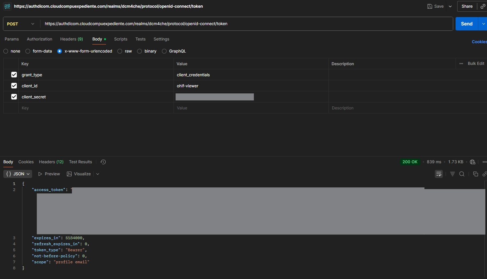

# OHIF Viewer Build & Run Instructions

## Prerequisites

- Docker
- Docker Compose
- Git

## Clone the Repository

```bash
git clone https://github.com/etahamad/Viewers
cd Viewers/platform/app/.recipes/Nginx-Dcm4chee-Keycloak
```

## Build the Viewer Image

```bash
docker compose build ohif_viewer
```

## (Optional) Tag and Push to Docker Hub

```bash
docker tag webapp:latest <docker-hub-username>/ohif-viewer:v3.x.x
docker push <docker-hub-username>/ohif-viewer:v3.x.x
```

## Run the Viewer

**Note:**
Mount your custom `app-config.js` from your server and set the `APP_CONFIG` environment variable to its path inside the container.
Do not change other configuration paths.

Example service definition for Docker Compose or Traefik:

```yaml
ohif-viewer:
  image: etahamad/ohif-viewer:v3.12.0-beta
  restart: unless-stopped
  ports:
    - 3000:80
  environment:
    - APP_CONFIG=/usr/share/nginx/html/app-config-temp.js
  volumes:
    - /etc/docker/viewerdicom/app-config.js:/usr/share/nginx/html/app-config-temp.js
  networks:
    - traefik_network
  labels:
    - traefik.enable=true
    - traefik.http.routers.ohif_app.rule=Host(`URL HERE`)
    - traefik.http.routers.ohif_app.entrypoints=websecure
    - traefik.http.routers.ohif_app.tls.certresolver=letsencryptresolver
    - traefik.http.routers.ohif_app.service=ohif_app
    - traefik.http.services.ohif_app.loadbalancer.server.port=80
    - traefik.http.services.ohif_app.loadbalancer.passhostheader=true
    - traefik.http.middlewares.sslheader.headers.customrequestheaders.X-Forwarded-Proto=https
    - traefik.http.routers.ohif_app.middlewares=sslheader@docker
```

## Token-Based Authentication Setup

This section covers how to configure OHIF Viewer with Keycloak for token-based authentication.

### 1. Enable Client Secret in Keycloak

1. **Access Keycloak Admin Console**
   - Navigate to your Keycloak admin interface
   - Login with admin credentials

2. **Configure the OHIF Client**
   - Go to `Clients` → `ohif-viewer`
   - Set `Access Type` to `confidential`
   - Enable `Service accounts roles` if needed
   - Save the configuration

3. **Generate Client Secret**
   - In the `Credentials` tab of your client
   - Copy the generated `Secret` value
   - This will be used in your app-config.js

### 2. Configure app-config.js for Token Authentication

Create or update your `app-config.js` file with the following configuration:

```javascript
/** @type {AppTypes.Config} */
window.config = {
  routerBasename: "/",
  showStudyList: true,
  extensions: [],
  modes: [],
  showWarningMessageForCrossOrigin: true,
  showCPUFallbackMessage: true,
  showLoadingIndicator: true,
  strictZSpacingForVolumeViewport: true,
  oidc: [
    {
      authority: "https://your-keycloak-domain/realms/your-realm",
      client_id: "ohif-viewer",
      client_secret: "YOUR_CLIENT_SECRET_HERE",
      redirect_uri: "https://your-viewer-domain/callback",
      response_type: "id_token token",
      scope: "openid email profile",
      post_logout_redirect_uri: "https://your-viewer-domain/",
      automaticSilentRenew: true,
      revokeAccessTokenOnSignout: true,
      // Additional Keycloak-specific settings
      loadUserInfo: true,
      includeIdTokenInSilentRenew: true,
      // Token validation settings
      validateSubOnSilentRenew: true,
      // Additional scopes for better integration
      extraQueryParams: {
        'kc_idp_hint': 'keycloak'
      }
    }
  ],
  defaultDataSourceName: "dicomweb",
  dataSources: [
    {
      namespace: "@ohif/extension-default.dataSourcesModule.dicomweb",
      sourceName: "dicomweb",
      configuration: {
        friendlyName: "DCM4CHEE Server",
        name: "DCM4CHEE",
        wadoUriRoot: "https://your-pacs-domain/dcm4chee-arc/aets/DCM4CHEE/wado",
        qidoRoot: "https://your-pacs-domain/dcm4chee-arc/aets/DCM4CHEE/rs",
        wadoRoot: "https://your-pacs-domain/dcm4chee-arc/aets/DCM4CHEE/rs",
        qidoSupportsIncludeField: false,
        imageRendering: "wadors",
        thumbnailRendering: "wadors",
        dicomUploadEnabled: true,
        omitQuotationForMultipartRequest: true,
        // Add authentication headers for DICOM requests
        requestHooks: [
          (request, context) => {
            // This will automatically add the Bearer token to DICOM requests
            return request;
          }
        ]
      }
    }
  ],
  // Additional configuration for better token handling
  studyListFunctionsEnabled: true,
  // Enable token-based authentication
  enableTokenAuthentication: true,
  customErrorHandler: (error) => {
    console.error('OHIF Error:', error);
    if (error.message && error.message.includes('authentication')) {
      console.log('Authentication error detected, redirecting to login...');
    }
  }
};
```

**Important Configuration Notes:**
- Replace `YOUR_CLIENT_SECRET_HERE` with the actual client secret from Keycloak
- Update all domain URLs to match your environment
- The `client_secret` enables confidential client authentication
- `automaticSilentRenew` ensures tokens are refreshed automatically
- `requestHooks` automatically adds Bearer tokens to DICOM requests

### 3. Docker Compose Configuration with CORS Disabled

Update your `docker-compose.yml` to disable CORS via Traefik middleware:

```yaml
services:
  ldap:
    image: dcm4che/slapd-dcm4chee:2.6.6-32.1
    volumes:
      - ldap_data:/var/lib/openldap/openldap-data
      - ldap_config:/etc/openldap/slapd.d
    networks:
      - traefik_network
    ports:
      - "389:389"
    healthcheck:
      test: ["CMD", "ldapsearch", "-H", "ldap://localhost:389", "-D", "cn=admin,dc=dcm4che,dc=org", "-w", "secret", "-b", "dc=dcm4che,dc=org", "-s", "base"]
      interval: 30s
      timeout: 10s
      retries: 5
      start_period: 60s

  keycloak:
    image: dcm4che/keycloak:26.0.6
    restart: unless-stopped
    environment:
      - KEYCLOAK_USER=admin
      - KEYCLOAK_PASSWORD=your-admin-password
      - KEYCLOAK_ADMIN=admin
      - KEYCLOAK_ADMIN_PASSWORD=your-admin-password
      - KC_BOOTSTRAP_ADMIN_USERNAME=admin
      - KC_BOOTSTRAP_ADMIN_PASSWORD=your-admin-password
      - KC_DB_VENDOR=postgres
      - KC_DB=postgres
      - KC_DB_URL=jdbc:postgresql://your-db-host:5432/keycloak
      - KC_DB_USERNAME=your-db-username
      - KC_DB_PASSWORD=your-db-password
      - KC_HOSTNAME=https://your-keycloak-domain
      - KC_HTTP_PORT=8080
      - KC_HTTPS_PORT=8843
      - KC_HOSTNAME_BACKCHANNEL_DYNAMIC=false
      - KC_HOSTNAME_STRICT=false
      - KC_HOSTNAME_STRICT_HTTPS=false
      - KC_HTTP_ENABLED=true
      - KEYCLOAK_WAIT_FOR=ldap:389
      - KEYCLOAK_LDAP_URL=ldap://ldap:389
      # CORS Configuration
      - KC_SPI_CORS_ALLOWED_ORIGINS=*
      - KC_SPI_CORS_ALLOWED_METHODS=GET,POST,PUT,DELETE,OPTIONS,HEAD
      - KC_SPI_CORS_ALLOWED_HEADERS=*
      - KC_SPI_CORS_EXPOSED_HEADERS=*
      - KC_SPI_CORS_ALLOW_CREDENTIALS=true
      - KC_SPI_CORS_MAX_AGE=1000
    depends_on:
      ldap:
        condition: service_healthy
    networks:
      - traefik_network
    labels:
      - traefik.enable=true
      - traefik.http.routers.keycloak_app.rule=Host(`your-keycloak-domain`)
      - traefik.http.routers.keycloak_app.entrypoints=websecure
      - traefik.http.routers.keycloak_app.tls.certresolver=letsencryptresolver
      - traefik.http.routers.keycloak_app.service=keycloak_app
      - traefik.http.services.keycloak_app.loadbalancer.server.port=8080
      - traefik.http.services.keycloak_app.loadbalancer.passhostheader=true
      - traefik.http.middlewares.sslheader.headers.customrequestheaders.X-Forwarded-Proto=https
      # CORS middleware for Keycloak
      - traefik.http.middlewares.keycloak-cors.headers.accesscontrolallowmethods=GET,POST,PUT,DELETE,OPTIONS,HEAD
      - traefik.http.middlewares.keycloak-cors.headers.accesscontrolalloworiginlist=*
      - traefik.http.middlewares.keycloak-cors.headers.accesscontrolallowheaders=*
      - traefik.http.middlewares.keycloak-cors.headers.accesscontrolallowcredentials=true
      - traefik.http.middlewares.keycloak-cors.headers.accesscontrolmaxage=1000
      - traefik.http.routers.keycloak_app.middlewares=sslheader@docker,keycloak-cors@docker
    ports:
      - "8080:8080"
      - "8843:8843"

  dcm4chee:
    image: dcm4che/dcm4chee-arc-psql:5.34.1
    restart: unless-stopped
    ports:
      - "8847:8080"
      - "8443:8443"
      - "9990:9990"
      - "9993:9993"
      - "8787:8787"
      - "11112:11112"
      - "2762:2762"
      - "2575:2575"
      - "12575:12575"
    depends_on:
      ldap:
        condition: service_healthy
      keycloak:
        condition: service_started
    environment:
      - WILDFLY_ADMIN_USER=admin
      - WILDFLY_ADMIN_PASSWORD=your-admin-password
      - WILDFLY_PACSDS_USE_CCM=false
      - POSTGRES_DB=pacsdb
      - POSTGRES_USER=your-db-username
      - POSTGRES_PASSWORD=your-db-password
      - POSTGRES_HOST=your-db-host
      - POSTGRES_PORT=5432
      - AUTH_SERVER_URL=https://your-keycloak-domain
      - UI_AUTH_SERVER_URL=https://your-keycloak-domain
      - WILDFLY_CHOWN=/opt/wildfly/standalone /storage
    volumes:
      - dcm4chee_storage:/storage
      - dcm4chee-wildfly:/opt/wildfly/standalone
    networks:
      - traefik_network
    labels:
      - traefik.enable=true
      - traefik.http.routers.dcm4chee_app.rule=Host(`your-pacs-domain`)
      - traefik.http.routers.dcm4chee_app.entrypoints=websecure
      - traefik.http.routers.dcm4chee_app.tls.certresolver=letsencryptresolver
      - traefik.http.routers.dcm4chee_app.service=dcm4chee_app
      - traefik.http.services.dcm4chee_app.loadbalancer.server.port=8080
      - traefik.http.services.dcm4chee_app.loadbalancer.passhostheader=true
      - traefik.http.middlewares.sslheader.headers.customrequestheaders.X-Forwarded-Proto=https
      # CORS middleware for DCM4CHEE
      - traefik.http.middlewares.dcm4chee-cors.headers.accesscontrolallowmethods=GET,POST,PUT,DELETE,OPTIONS,HEAD
      - traefik.http.middlewares.dcm4chee-cors.headers.accesscontrolalloworiginlist=*
      - traefik.http.middlewares.dcm4chee-cors.headers.accesscontrolallowheaders=*
      - traefik.http.middlewares.dcm4chee-cors.headers.accesscontrolallowcredentials=true
      - traefik.http.middlewares.dcm4chee-cors.headers.accesscontrolmaxage=1000
      - traefik.http.routers.dcm4chee_app.middlewares=sslheader@docker,dcm4chee-cors@docker

  ohif-viewer:
    image: etahamad/ohif-viewer:269da79
    restart: unless-stopped
    ports:
      - 3000:80
    environment:
      - APP_CONFIG=/usr/share/nginx/html/app-config-temp.js
    volumes:
      - /etc/docker/viewerdicom/app-config.js:/usr/share/nginx/html/app-config-temp.js
    networks:
      - traefik_network
    labels:
      - traefik.enable=true
      - traefik.http.routers.ohif_app.rule=Host(`your-viewer-domain`)
      - traefik.http.routers.ohif_app.entrypoints=websecure
      - traefik.http.routers.ohif_app.tls.certresolver=letsencryptresolver
      - traefik.http.routers.ohif_app.service=ohif_app
      - traefik.http.services.ohif_app.loadbalancer.server.port=80
      - traefik.http.services.ohif_app.loadbalancer.passhostheader=true
      - traefik.http.middlewares.sslheader.headers.customrequestheaders.X-Forwarded-Proto=https
      # CORS middleware for OHIF Viewer
      - traefik.http.middlewares.ohif-cors.headers.accesscontrolallowmethods=GET,POST,PUT,DELETE,OPTIONS,HEAD
      - traefik.http.middlewares.ohif-cors.headers.accesscontrolalloworiginlist=*
      - traefik.http.middlewares.ohif-cors.headers.accesscontrolallowheaders=*
      - traefik.http.middlewares.ohif-cors.headers.accesscontrolallowcredentials=true
      - traefik.http.middlewares.ohif-cors.headers.accesscontrolmaxage=1000
      - traefik.http.routers.ohif_app.middlewares=sslheader@docker,ohif-cors@docker

volumes:
  dcm4chee_storage:
  dcm4chee-wildfly:
  ldap_data:
  ldap_config:

networks:
  traefik_network:
    external: true
```

### 4. CORS Configuration Notes

The CORS configuration in the Docker Compose file includes:

- **Keycloak CORS**: Allows cross-origin requests for authentication
- **DCM4CHEE CORS**: Enables DICOM web services access
- **OHIF Viewer CORS**: Permits viewer to communicate with backend services

**Security Considerations:**
- Use HTTPS for all services
- Regularly rotate client secrets
- Monitor authentication logs

### 5. Generating Access Tokens

You can generate access tokens programmatically using the Keycloak token endpoint:

```bash
curl -X POST "https://your-keycloak-domain/realms/your-realm/protocol/openid-connect/token" \
  -H "Content-Type: application/x-www-form-urlencoded" \
  -d "grant_type=client_credentials" \
  -d "client_id=ohif-viewer" \
  -d "client_secret=YOUR_CLIENT_SECRET_HERE"
```

**Response Example:**
```json
{
  "access_token": "eyJhbGciOiJSUzI1NiIsInR5cCI6IkpXVCJ9...",
  "expires_in": 300,
  "refresh_expires_in": 1800,
  "token_type": "Bearer",
  "not-before-policy": 0,
  "scope": "profile email"
}
```

**Postman Configuration:**

*Figure: Postman configuration for generating access tokens via Keycloak token endpoint*

**Using the Access Token:**

**Direct URL Access**
You can pass the access token directly in the OHIF Viewer URL:

```bash
# Access OHIF Viewer with a specific study and token
https://your-viewer-domain/viewer?StudyInstanceUIDs=STUDY_INSTANCE_UID&token=YOUR_ACCESS_TOKEN_HERE
```

**Example:**
```bash
https://viewerdicom.cloudcompuexpediente.com/viewer?StudyInstanceUIDs=1.3.6.1.4.1.44316.6.102.1.2023091383923657.429661656218407401559&token=eyJhbGciOiJSUzI1NiIsInR5cCI6IkpXVCJ9...
```

**Token Parameters:**
- `grant_type=client_credentials`: Uses client credentials flow (no user interaction required)
- `client_id`: Your Keycloak client ID
- `client_secret`: The secret generated in Keycloak admin console
- `expires_in`: Token validity period in seconds (typically 300 seconds = 5 minutes)

### 6. Testing Token Authentication

1. **Start the services:**
   ```bash
   docker compose up -d
   ```

2. **Verify Keycloak is accessible:**
   - Navigate to your Keycloak admin console
   - Verify the `ohif-viewer` client is configured correctly

3. **Test Access Token Generation:**
   - Use the curl command above to generate an access token
   - Verify the token is valid and contains expected claims

4. **Test OHIF Viewer:**
   - Access your viewer URL
   - You should be redirected to Keycloak for authentication
   - After login, you should be redirected back to the viewer
   - Verify that DICOM studies load correctly

5. **Check token functionality:**
   - Open browser developer tools
   - Check Network tab for Bearer token headers in DICOM requests
   - Verify token renewal is working automatically

## Notes

- The `APP_CONFIG` environment variable must match the path inside the container where your config is mounted.
- For production, configure Traefik and SSL as needed.
- For troubleshooting, ensure file permissions are correct and the config file is readable by the container.
- Always use strong, unique passwords and client secrets in production environments.
- Regularly update Docker images and dependencies for security patches.
